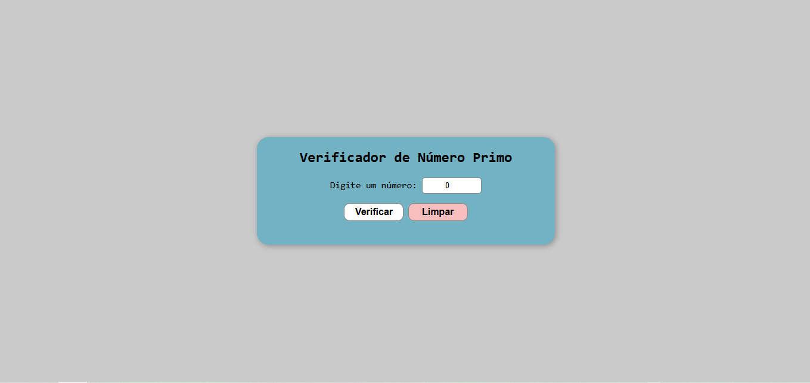

# 🔍 Verificador de Número Primo

Um projeto simples feito com HTML, CSS e JavaScript para verificar se um número é primo. O usuário digita um número e o programa informa se ele é primo ou não, além de mostrar os divisores do número.

## 💡 Funcionalidades

- Verifica se o número digitado é primo
- Mostra os divisores do número
- Dá feedback visual (cores e mensagens)
- Validação para impedir números menores ou iguais a 1
- Botão para limpar os dados inseridos

## 🛠️ Tecnologias Utilizadas

- HTML5
- CSS3
- JavaScript

## 📸 Captura de Tela



## 🚀 Como usar

1. Clone o repositório:
   ```bash
   git clone https://github.com/Marceloa20/verificador-numero-primo
